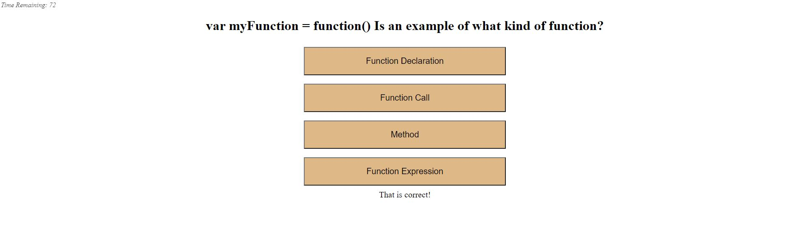

#Code Quiz!

A basic coding quiz that tracks the number of questions a user gets correct, and then records them to local storage.

Quiz can be easily updated later to add more questions if neccessary, as well as more advanced styling options. 

Live Link: https://meshuganah.github.io/Coding-Quiz/

